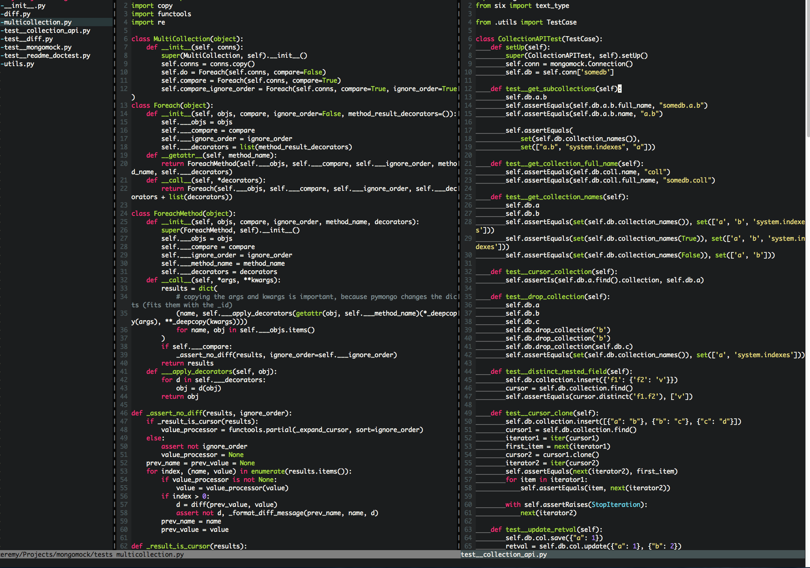

# viminit
=======
All that syntax checking, auto indent, nerdtree, fuzzy search (filename, filecontent) goodness installed as unobtrusive as possible so you can get to work without a bunch of magic happening (and without rubygems!)

Simple bash script which installs pathogen, and git clones popular repo's into bundle, and modify's vimrc.



## Tested on
- debian7
- centos6
- OSX Lion/Mavericks
- Freebsd 10

## Works great with
- Python auto indentation, pep8 check on filesave, whitespace indicator (courtesy of https://github.com/nvie/vim-flake8)
- Don't forget to install flake8: pip install flake8

## TODO:
- create backups of exists vim directory / vimrc
- only run flake8 on python filesave if flake8 exists
- javascript goodies
- ruby goodies
- go goodies

## Installation
```bash
$ curl -Lo- --insecure https://raw.github.com/jeraldrich/viminit/master/viminit.sh | bash
```
That's it. 
It's not going to win any code artshows, but it gets the job done (In under 10 seconds) :ok_hand:

