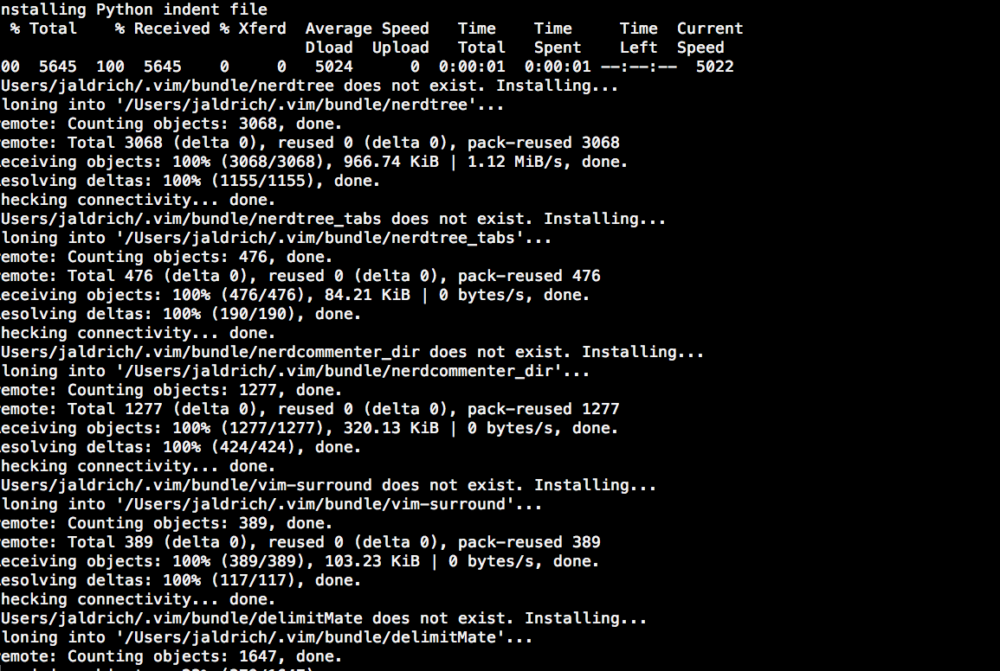

# viminit
=======



viminit! when you just want all that syntax checking, auto indent, nerdtree, fuzzy search goodness installed on any environment in one command

## Installation
```bash
$ curl -Lo- --insecure https://raw.github.com/jeraldrich/viminit/master/viminit.sh | bash
```

BAM. Done. No babysitting rubygems. Now get to work!! ;) 
